# 简牍目标检测：核心架构原理深度解析

> **学习目标**：通过 Mermaid 架构图 + 最小可运行代码，彻底理解 YOLOv8 → YOLO11 → 简牍特化模型的架构演进逻辑。  
> **使用方式**：每个 `###` 步骤对应一个 Jupyter 单元格，按顺序运行。  
> **前置条件**：已完成 TASK_B 微调实验，有 `yolov8n.pt` 和 `yolo11s.pt` 权重文件。

---

## 目录

1. [YOLOv8 基础框架](#一yolov8-基础框架)
2. [YOLO11 架构创新](#二yolo11-架构创新)
3. [APS-YOLO：尺度自适应](#三aps-yolo尺度自适应单字检测)
4. [DeConv-YOLO：可变形感知](#四deconv-yolo可变形感知扭曲文字)
5. [RGA-CRNN：序列识别](#五rga-crnn序列识别读出文字)

---

## 一、YOLOv8 基础框架

### 1.1 整体架构概览

YOLOv8 是一个三段式结构：**Backbone（提特征）→ Neck（融特征）→ Head（出结果）**。  
理解这三段是理解所有后续改进的基础。

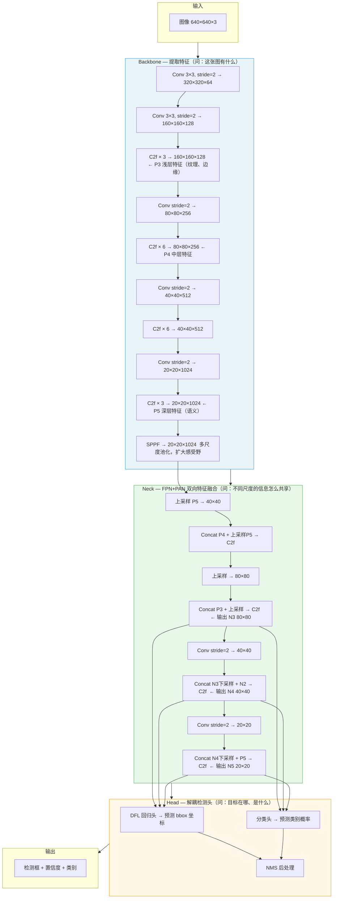

---

### 1.2 C2f 模块——YOLOv8 的核心积木

C2f 是 Cross Stage Partial with more features 的缩写，核心思想是**让特征分叉流动，保留梯度路径**。

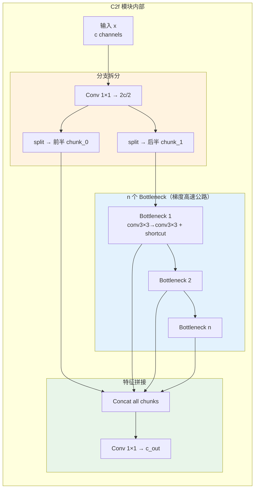

**关键理解**：C2f 不是所有特征都过 Bottleneck，而是一半直接跳过去和最终输出 Concat。这样做的好处是梯度可以从输出直接流回输入，不会在深层网络中消失。

---

### 1.3 解耦检测头——分类和定位为什么要分开

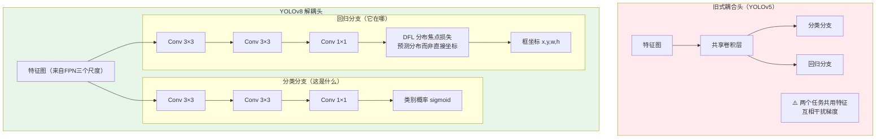

**关键理解**：
- 分类任务：需要高层语义特征（"这是汉字还是杂物"）
- 回归任务：需要精细的边缘定位信息（"框在哪个像素"）
- 强行共享这两种特征，两个任务会互相拉扯梯度

---

### 步骤 1：安装依赖

```python
# 步骤 1：安装依赖（首次运行）
!pip install ultralytics torchvision -q
```

---

### 步骤 2：打印 YOLOv8 完整层结构

```python
# 步骤 2：打印 YOLOv8 完整层结构
# 目的：把上面的 Mermaid 图和实际代码对上号
# 观察：找到 C2f、SPPF、DFL 这几个关键组件在第几层

from ultralytics import YOLO

model_v8 = YOLO('yolov8n.yaml')   # 只加载架构，不下载权重

print("=== YOLOv8n 完整层结构 ===\n")
for i, layer in enumerate(model_v8.model.model):
    layer_type = type(layer).__name__
    
    # 尝试获取输出通道数
    out_ch = ''
    if hasattr(layer, 'cv2') and hasattr(layer.cv2, 'conv'):
        out_ch = f"  out_channels={layer.cv2.conv.out_channels}"
    elif hasattr(layer, 'conv') and hasattr(layer.conv, 'out_channels'):
        out_ch = f"  out_channels={layer.conv.out_channels}"
    
    print(f"  第 {i:2d} 层: {layer_type}{out_ch}")

print(f"\n总层数: {len(model_v8.model.model)}")
```

---

### 步骤 3：亲手数 C2f 内部的 Bottleneck 数量

```python
# 步骤 3：解剖 C2f 模块内部
# 目的：验证不同位置的 C2f 堆叠了几个 Bottleneck（浅层少，深层多）

from ultralytics import YOLO
from ultralytics.nn.modules import C2f

model_v8 = YOLO('yolov8n.yaml')

print("=== 各 C2f 模块详情 ===\n")
c2f_count = 0
for i, layer in enumerate(model_v8.model.model):
    if isinstance(layer, C2f):
        c2f_count += 1
        n_bottleneck = len(layer.m)
        in_ch  = layer.cv1.conv.in_channels
        out_ch = layer.cv2.conv.out_channels
        print(f"  第 {i:2d} 层 C2f #{c2f_count}")
        print(f"    输入通道: {in_ch}  输出通道: {out_ch}")
        print(f"    Bottleneck 堆叠数: {n_bottleneck}  ← 越深的层叠越多")
        print()

# 思考题：为什么浅层 C2f 叠 3 个 Bottleneck，深层叠 6 个？
# 答：深层特征图尺寸小（20x20），计算量不大；
#     浅层特征图大（160x160），叠太多 Bottleneck 显存爆炸
```

---

### 步骤 4：用张量跟踪理解特征图尺寸变化

```python
# 步骤 4：用 Hook 追踪每一层的特征图尺寸
# 目的：直观理解"特征图从大变小，最后在 Neck 里又变大"的过程

import torch
from ultralytics import YOLO

model_v8 = YOLO('yolov8n.pt')
model_v8.model.eval()

feature_shapes = []

def make_hook(layer_idx, layer_name):
    def hook(module, input, output):
        if isinstance(output, torch.Tensor):
            feature_shapes.append({
                'idx':   layer_idx,
                'name':  layer_name,
                'shape': list(output.shape)
            })
    return hook

# 注册 Hook
handles = []
for i, layer in enumerate(model_v8.model.model):
    h = layer.register_forward_hook(make_hook(i, type(layer).__name__))
    handles.append(h)

# 跑一次前向传播
dummy_input = torch.zeros(1, 3, 640, 640)
with torch.no_grad():
    _ = model_v8.model(dummy_input)

# 清理 Hook
for h in handles:
    h.remove()

# 打印结果
print(f"{'层':>4}  {'类型':<20}  {'输出形状'}")
print("-" * 50)
for info in feature_shapes:
    shape_str = str(info['shape'])
    print(f"  {info['idx']:2d}   {info['name']:<20}  {shape_str}")

# 重点观察：
#   - 640→320→160→80→40→20：Backbone 逐步下采样
#   - 20→40→80：Neck 上采样（FPN）
#   - 80→40→20：Neck 下采样（PAN）
```

---

## 二、YOLO11 架构创新

### 2.1 YOLO11 vs YOLOv8：改了什么

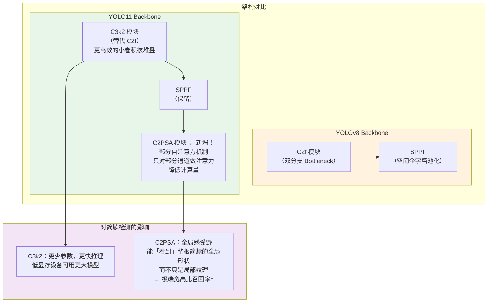

---

### 2.2 C3k2 模块——用小核替代大核

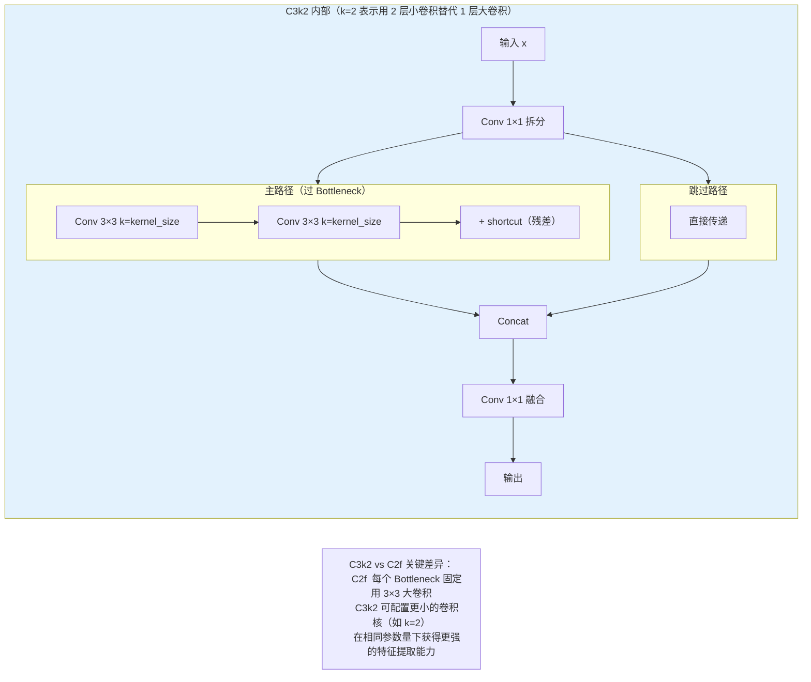

---

### 2.3 C2PSA 模块——为什么注意力机制对简牍有用

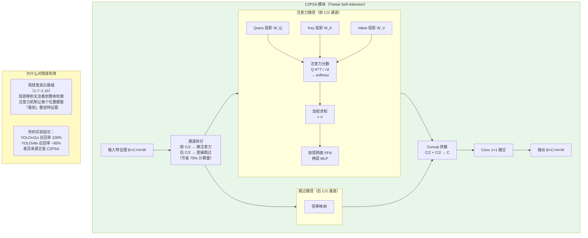

---

### 步骤 5：找到 YOLO11 的 C2PSA 层

```python
# 步骤 5：在 YOLO11 模型中定位 C2PSA 注意力模块
# 目的：确认注意力机制存在，并查看它在第几层被引入

from ultralytics import YOLO

model_v11 = YOLO('yolo11s.yaml')

print("=== YOLO11s 全部层类型 ===\n")
for i, layer in enumerate(model_v11.model.model):
    layer_type = type(layer).__name__
    marker = '  ← 【注意力模块！】' if 'PSA' in layer_type else ''
    print(f"  第 {i:2d} 层: {layer_type}{marker}")

print("\n观察：C2PSA 在深层（靠近 Neck 的位置），这是有意为之——")
print("浅层做局部纹理提取，深层做全局语义理解，符合人类视觉的认知层次。")
```

---

### 步骤 6：对比 C2f 和 C3k2 的参数量

```python
# 步骤 6：量化对比 C2f vs C3k2 参数量
# 目的：用数字理解"YOLO11 为什么更高效"

import torch
import torch.nn as nn
from ultralytics import YOLO
from ultralytics.nn.modules import C2f

# 手动构建同等规模的 C2f
c2f_module = C2f(c1=256, c2=256, n=3)

# 载入 YOLO11，找第一个 C3k2
model_v11 = YOLO('yolo11s.yaml')
c3k2_module = None
for layer in model_v11.model.model:
    if 'C3k2' in type(layer).__name__:
        c3k2_module = layer
        break

def count_params(module):
    return sum(p.numel() for p in module.parameters())

print("=== 参数量对比（输入输出通道均为 256，n=3）===")
print(f"  C2f  参数量: {count_params(c2f_module):>10,}")
if c3k2_module:
    print(f"  C3k2 参数量: {count_params(c3k2_module):>10,}")
    ratio = count_params(c2f_module) / count_params(c3k2_module)
    print(f"\n  C2f / C3k2 = {ratio:.2f}x  ← YOLO11 更轻量")

print("\n延伸思考：参数量减少，精度却更高，说明 C3k2 的归纳偏置更适合该任务——")
print("更小的卷积核迫使网络学习更细粒度的局部模式，而简牍字符恰好依赖细微笔画差异。")
```

---

### 步骤 7：手动模拟自注意力，感受全局感受野

```python
# 步骤 7：最小实现 —— 自注意力 vs 卷积的感受野对比
# 目的：直观理解"为什么注意力能看到整个简牍"
# 核心概念：卷积的感受野受层数限制，注意力的感受野是全局的

import torch
import torch.nn as nn
import torch.nn.functional as F
import matplotlib.pyplot as plt

class MinimalSelfAttention(nn.Module):
    """最小化自注意力，帮助理解原理"""
    def __init__(self, dim, num_heads=4):
        super().__init__()
        self.num_heads = num_heads
        self.scale = (dim // num_heads) ** -0.5
        self.qkv = nn.Linear(dim, dim * 3)
        self.proj = nn.Linear(dim, dim)

    def forward(self, x):
        B, N, C = x.shape  # B=batch, N=序列长度(H*W), C=通道
        qkv = self.qkv(x).reshape(B, N, 3, self.num_heads, C // self.num_heads).permute(2, 0, 3, 1, 4)
        q, k, v = qkv[0], qkv[1], qkv[2]

        # 注意力分数：每个位置和所有其他位置的相关性
        attn = (q @ k.transpose(-2, -1)) * self.scale  # (B, heads, N, N)
        attn = attn.softmax(dim=-1)

        out = (attn @ v).transpose(1, 2).reshape(B, N, C)
        return self.proj(out), attn

# 模拟一个 20×20 的简牍特征图
H, W, C = 20, 20, 64
x_flat = torch.randn(1, H * W, C)  # 展平成序列

attn_module = MinimalSelfAttention(dim=C)
out, attn_weights = attn_module(x_flat)

# 可视化：某一个位置（模拟简牍中间点）对全图的注意力分布
query_pos = H // 2 * W + W // 2   # 图像正中心
attn_map  = attn_weights[0, 0, query_pos, :].detach().reshape(H, W)

fig, axes = plt.subplots(1, 2, figsize=(12, 5))

# 左图：注意力热图
im = axes[0].imshow(attn_map.numpy(), cmap='hot', interpolation='nearest')
axes[0].scatter([W // 2], [H // 2], c='cyan', s=100, zorder=5, label='查询位置')
axes[0].set_title('自注意力热图：中心点关注了哪些位置？\n（亮 = 注意力高）')
axes[0].legend()
plt.colorbar(im, ax=axes[0])

# 右图：3×3 卷积的有效感受野（仅覆盖局部）
conv_rf = torch.zeros(H, W)
cy, cx  = H // 2, W // 2
conv_rf[max(0, cy-1):cy+2, max(0, cx-1):cx+2] = 1.0
axes[1].imshow(conv_rf.numpy(), cmap='Blues', interpolation='nearest')
axes[1].set_title('3×3 卷积的单次感受野\n（只能看到 9 个像素）')

plt.tight_layout()
plt.savefig('attention_vs_conv_receptive_field.png', dpi=150, bbox_inches='tight')
plt.show()
print("结论：")
print("  卷积：1 次只看 9 个像素，要堆很多层才能看到全图")
print("  注意力：1 次看全部 400 个像素（20×20），直接捕获细长简牍的整体形态")
```

---

## 三、APS-YOLO：尺度自适应单字检测

### 3.1 APS-YOLO 解决什么问题

**问题**：一根简牍上，大字（`月`）和细小笔画（`丶`）可能相差 10 倍尺寸，标准 FPN 对固定尺度分配特征图，处理不了这种极端尺度变化。

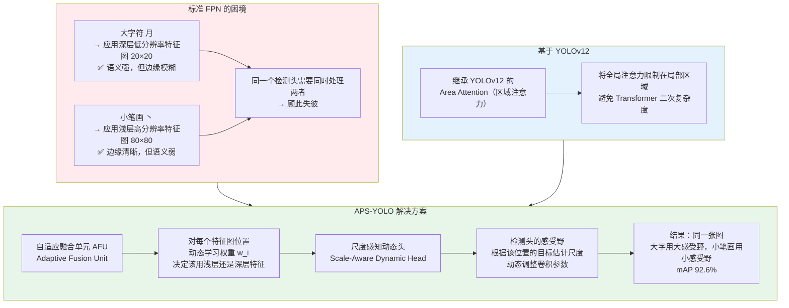

---

### 3.2 自适应融合单元（AFU）架构

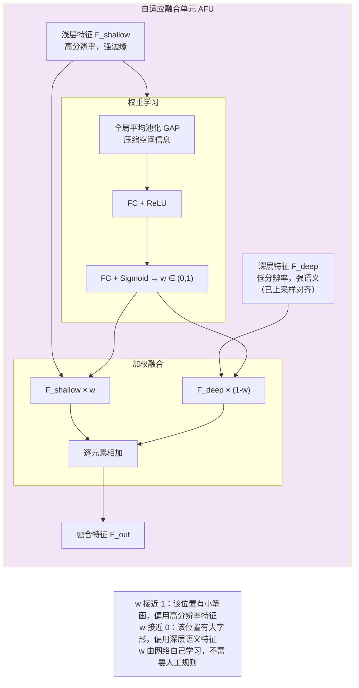

---

### 步骤 8：AFU 最小实现

```python
# 步骤 8：自适应特征融合单元（AFU）最小实现
# 理解"动态权重"如何根据特征内容自动调整

import torch
import torch.nn as nn

class AdaptiveFusionUnit(nn.Module):
    """
    APS-YOLO 的自适应融合单元
    通过 Squeeze-Excitation 机制学习浅层/深层特征的融合权重
    """
    def __init__(self, channels: int, reduction: int = 16):
        super().__init__()
        # Squeeze：全局平均池化 → 压缩空间维度，得到全局通道描述符
        self.squeeze = nn.AdaptiveAvgPool2d(1)
        # Excitation：两层 FC 学习通道权重
        self.excitation = nn.Sequential(
            nn.Flatten(),
            nn.Linear(channels, channels // reduction),
            nn.ReLU(inplace=True),
            nn.Linear(channels // reduction, 1),
            nn.Sigmoid()   # 输出标量权重 w ∈ (0, 1)
        )

    def forward(self, f_shallow: torch.Tensor, f_deep: torch.Tensor) -> torch.Tensor:
        # 用浅层特征的全局统计量来决定融合权重
        # 逻辑：如果浅层有丰富的高频纹理（小笔画），就多用浅层
        global_desc = self.squeeze(f_shallow)           # (B, C, 1, 1)
        w = self.excitation(global_desc).view(-1, 1, 1, 1)  # (B, 1, 1, 1) 标量权重

        fused = f_shallow * w + f_deep * (1.0 - w)
        return fused, w.squeeze()

# ---- 验证 ----
batch, C, H, W = 2, 64, 80, 80

# 模拟：浅层有明显纹理（简牍笔画），深层特征较平滑
f_shallow = torch.randn(batch, C, H, W) * 2.0   # 高方差 → 丰富纹理
f_deep    = torch.randn(batch, C, H, W) * 0.5   # 低方差 → 平滑语义

afu = AdaptiveFusionUnit(channels=C)
output, weights = afu(f_shallow, f_deep)

print(f"浅层特征形状:  {f_shallow.shape}")
print(f"深层特征形状:  {f_deep.shape}")
print(f"融合输出形状:  {output.shape}")
print(f"学习到的融合权重 w:")
for i, w in enumerate(weights.detach().tolist()):
    print(f"  样本 {i}: w={w:.4f}  →  {w:.0%} 浅层 + {1-w:.0%} 深层")
print("\n梯度验证：权重 w 是可学习的，会通过反向传播优化")
print(f"  AFU 参数量: {sum(p.numel() for p in afu.parameters()):,}")
```

---

### 步骤 9：尺度感知动态头原理

```python
# 步骤 9：尺度感知动态头（Scale-Aware Dynamic Head）的核心思路
# 原理：对每个检测位置，预测一个"尺度偏移"，动态调整感受野

import torch
import torch.nn as nn
import torch.nn.functional as F

class ScaleAwareDynamicHead(nn.Module):
    """
    简化版尺度感知动态头
    核心：不用固定 3×3 卷积，而是根据预测的尺度动态生成卷积参数
    （完整版用动态卷积 Dynamic Convolution，这里用通道注意力近似）
    """
    def __init__(self, in_channels: int, num_classes: int = 1):
        super().__init__()
        # 尺度预测分支：估计该位置目标的大概尺度
        self.scale_predictor = nn.Sequential(
            nn.AdaptiveAvgPool2d(1),
            nn.Flatten(),
            nn.Linear(in_channels, 3),   # 3 种尺度：小/中/大
            nn.Softmax(dim=-1)
        )
        # 三套卷积，分别适配三种尺度
        self.conv_small  = nn.Conv2d(in_channels, in_channels, kernel_size=1)          # 小目标：1×1
        self.conv_medium = nn.Conv2d(in_channels, in_channels, kernel_size=3, padding=1) # 中目标：3×3
        self.conv_large  = nn.Conv2d(in_channels, in_channels, kernel_size=5, padding=2) # 大目标：5×5

        self.cls_head = nn.Conv2d(in_channels, num_classes, kernel_size=1)
        self.reg_head = nn.Conv2d(in_channels, 4, kernel_size=1)

    def forward(self, x: torch.Tensor):
        # 预测尺度分布
        scale_weights = self.scale_predictor(x)  # (B, 3)
        w_s, w_m, w_l = scale_weights[:, 0], scale_weights[:, 1], scale_weights[:, 2]

        # 三套卷积的加权融合（软路由）
        f = (self.conv_small(x)  * w_s.view(-1, 1, 1, 1) +
             self.conv_medium(x) * w_m.view(-1, 1, 1, 1) +
             self.conv_large(x)  * w_l.view(-1, 1, 1, 1))

        return self.cls_head(f), self.reg_head(f), scale_weights

# ---- 验证 ----
feat_map = torch.randn(2, 256, 40, 40)
head = ScaleAwareDynamicHead(in_channels=256, num_classes=1)
cls_out, reg_out, scale_w = head(feat_map)

print(f"输入特征图: {feat_map.shape}")
print(f"分类输出:   {cls_out.shape}  → 每个位置的类别得分")
print(f"回归输出:   {reg_out.shape}  → 每个位置的框坐标偏移")
print(f"\n尺度权重分布（softmax 归一化）：")
for i, (ws, wm, wl) in enumerate(scale_w.detach().tolist()):
    print(f"  样本 {i}: 小目标={ws:.2f}  中目标={wm:.2f}  大目标={wl:.2f}")
```

---

## 四、DeConv-YOLO：可变形感知扭曲文字

### 4.1 为什么扭曲/倾斜文字难检测

```mermaid
graph TB
    subgraph PROBLEM["传统卷积的局限"]
        P1["标准 3×3 卷积\n采样点固定在规则网格上"]
        P2["对于倾斜的简牍\n9 个采样点里\n有几个落在背景上\n而非文字上"]
        P3["结果：特征被噪声污染\n边界框回归不准"]
        P1-->P2-->P3
    end

    subgraph DCN["可变形卷积 DCN 的解法"]
        D1["额外学习 18 个偏移量\n(9 个点 × 2 个方向 x,y)"]
        D2["偏移量由网络\n根据图像内容自动学习"]
        D3["采样点沿着文字笔画走\n而不是死板地在方格上"]
        D4["结果：感受野自适应文字形状"]
        D1-->D2-->D3-->D4
    end

    subgraph FORMULA["数学公式"]
        F1["标准卷积：y(p) = Σ w(k) · x(p + p_k)"]
        F2["可变形卷积：y(p) = Σ w(k) · x(p + p_k + Δp_k)"]
        F3["Δp_k 就是网络自己学出来的位移\n可以是浮点数，用双线性插值采样"]
        F1-->F2-->F3
    end

    style PROBLEM fill:#ffebee
    style DCN fill:#e8f5e9
    style FORMULA fill:#e3f2fd
```

---

### 4.2 DeConv-YOLO 完整架构

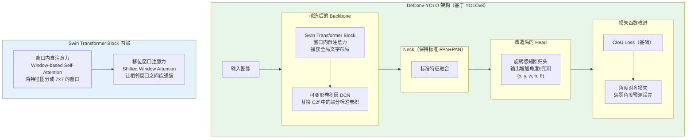

---

### 步骤 10：可变形卷积动手实验

```python
# 步骤 10：可变形卷积 DCN vs 标准卷积 —— 感受野可视化
# 直观看到：标准卷积采样点是规则方格，DCN 采样点跟着内容走

import torch
import torch.nn as nn
import torchvision.ops as ops
import matplotlib.pyplot as plt
import numpy as np

# =========================================
# 构造一个"倾斜线条"测试图像，模拟倾斜简牍
# =========================================
H, W = 64, 64
test_img = torch.zeros(1, 1, H, W)

# 画一条从左上到右下的斜线（模拟倾斜简牍边缘）
for i in range(H):
    j = int(i * W / H)
    if 0 <= j < W:
        test_img[0, 0, i, j] = 1.0
        # 加一点宽度
        for dj in [-1, 0, 1]:
            if 0 <= j+dj < W:
                test_img[0, 0, i, j+dj] = 0.7

# =========================================
# 对比：标准卷积 vs 可变形卷积
# =========================================

# 标准卷积权重（用于对比）
std_weight = torch.ones(1, 1, 3, 3) / 9.0  # 均值滤波器

# 可变形卷积：先用一个小网络预测偏移量
offset_net = nn.Conv2d(1, 18, kernel_size=3, padding=1)  # 9点×2方向=18通道
with torch.no_grad():
    # 让偏移量跟着图像梯度走（模拟网络已学习到"沿笔画偏移"的策略）
    # 真实情况下这是网络训练出来的
    offsets = offset_net(test_img)

std_out = torch.nn.functional.conv2d(test_img, std_weight, padding=1)
dcn_out = ops.deform_conv2d(test_img, offsets, std_weight, padding=1)

# 可视化
fig, axes = plt.subplots(1, 3, figsize=(15, 5))

axes[0].imshow(test_img[0, 0].numpy(), cmap='gray')
axes[0].set_title('输入：倾斜线条\n（模拟倾斜简牍）')

axes[1].imshow(std_out[0, 0].detach().numpy(), cmap='hot')
axes[1].set_title('标准卷积输出\n均匀采样，边缘响应分散')

axes[2].imshow(dcn_out[0, 0].detach().numpy(), cmap='hot')
axes[2].set_title('可变形卷积输出\n偏移采样，沿线条方向聚集')

# 在图上标出标准卷积的 9 个采样点
cy, cx = H // 2, W // 2
for dy in [-1, 0, 1]:
    for dx in [-1, 0, 1]:
        axes[1].plot(cx + dx, cy + dy, 'b+', markersize=10, markeredgewidth=2)
axes[1].set_xlim(cx-5, cx+5); axes[1].set_ylim(cy+5, cy-5)

plt.suptitle('标准卷积 vs 可变形卷积：感受野对比', fontsize=14, fontweight='bold')
plt.tight_layout()
plt.savefig('dcn_vs_standard_conv.png', dpi=150, bbox_inches='tight')
plt.show()

print(f"标准卷积输出形状:    {std_out.shape}")
print(f"可变形卷积输出形状:  {dcn_out.shape}")
print(f"偏移量张量形状:      {offsets.shape}  ← 18 = 9点 × 2方向")
print("\n可变形卷积的关键参数：")
print(f"  9 个采样点，每点有 (Δx, Δy) 两个偏移 → 共 18 个偏移值")
print(f"  偏移值是连续实数，采样用双线性插值实现可微")
```

---

### 步骤 11：Swin Transformer 窗口注意力原理

```python
# 步骤 11：Swin Transformer 窗口注意力 —— 最小实现
# 理解为什么 Swin 比标准 ViT 更适合检测任务

import torch
import torch.nn as nn
import torch.nn.functional as F

class WindowAttention(nn.Module):
    """
    Swin Transformer 的窗口自注意力（简化版）
    关键思想：把特征图分成 M×M 的小窗口，在窗口内做注意力
    复杂度从 O(N²) 降到 O(N × M²)，N 是总像素数，M 是窗口大小
    """
    def __init__(self, dim: int, window_size: int = 7, num_heads: int = 4):
        super().__init__()
        self.window_size = window_size
        self.num_heads   = num_heads
        self.scale       = (dim // num_heads) ** -0.5

        self.qkv  = nn.Linear(dim, dim * 3)
        self.proj = nn.Linear(dim, dim)

    def forward(self, x: torch.Tensor) -> torch.Tensor:
        B, H, W, C = x.shape  # 注意：Swin 的输入格式是 B H W C
        Mh = Mw = self.window_size

        # 分窗口
        x_windows = x.view(B, H // Mh, Mh, W // Mw, Mw, C)
        x_windows = x_windows.permute(0, 1, 3, 2, 4, 5).contiguous()
        x_windows = x_windows.view(-1, Mh * Mw, C)  # (B*num_windows, M*M, C)

        # 窗口内注意力
        nW, N, _ = x_windows.shape
        qkv = self.qkv(x_windows).reshape(nW, N, 3, self.num_heads, C // self.num_heads)
        qkv = qkv.permute(2, 0, 3, 1, 4)
        q, k, v = qkv[0], qkv[1], qkv[2]

        attn = (q @ k.transpose(-2, -1)) * self.scale
        attn = F.softmax(attn, dim=-1)
        out  = (attn @ v).transpose(1, 2).reshape(nW, N, C)
        out  = self.proj(out)

        # 还原形状
        out = out.view(B, H // Mh, W // Mw, Mh, Mw, C)
        out = out.permute(0, 1, 3, 2, 4, 5).contiguous().view(B, H, W, C)
        return out

# ---- 验证 ----
B, H, W, C = 1, 56, 56, 96   # 典型 Swin-Tiny 第一阶段特征图大小
x = torch.randn(B, H, W, C)

win_attn = WindowAttention(dim=C, window_size=7, num_heads=4)
out = win_attn(x)

num_windows = (H // 7) * (W // 7)
print(f"输入特征图: {x.shape}  (B, H, W, C)")
print(f"输出特征图: {out.shape}  形状不变，但注意力已重新分配")
print(f"\n窗口数量: {num_windows}  ({H//7}×{W//7})")
print(f"每窗口注意力序列长度: {7*7} = 49 个位置")
print(f"\n复杂度对比：")
print(f"  标准注意力: O(N²) = O({H*W}²) = O({(H*W)**2:,})")
print(f"  窗口注意力: O(N × M²) = O({H*W} × {7*7}) = O({H*W*49:,})")
print(f"  加速比: {(H*W)**2 / (H*W*49):.0f}×")
print("\n对简牍检测的意义：")
print("  每个窗口内的像素能互相通信（捕获局部文字结构）")
print("  通过移位窗口（Shifted Window）让跨窗口信息也能传播")
```

---

## 五、RGA-CRNN：序列识别，读出文字

### 5.1 OCR 识别流水线

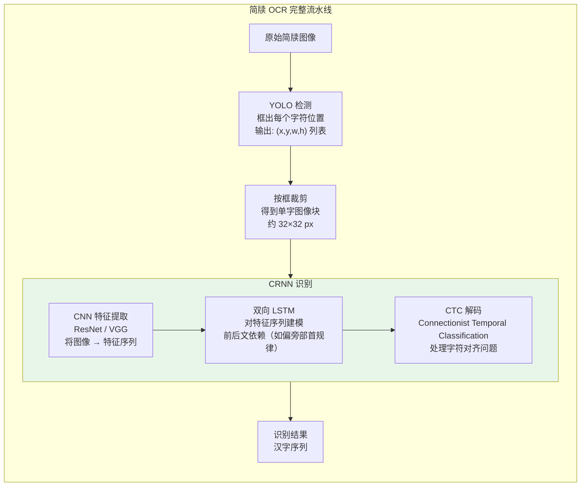

---

### 5.2 RGA 模块——解决模糊笔画的注意力门控

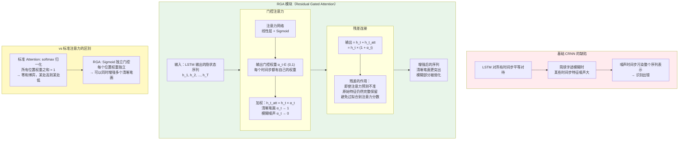

---

### 5.3 CTC 解码——为什么需要它

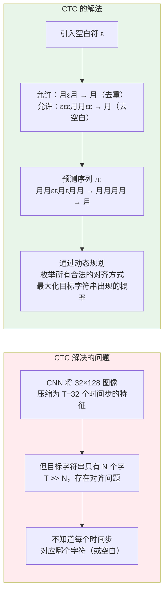

---

### 步骤 12：完整 CRNN 前向传播验证

```python
# 步骤 12：从零搭建一个能跑通的 CRNN 前向传播
# 目的：理解 CNN → RNN → CTC 的数据流

import torch
import torch.nn as nn

class ConvBNReLU(nn.Sequential):
    def __init__(self, in_ch, out_ch, k=3, s=1, p=1):
        super().__init__(
            nn.Conv2d(in_ch, out_ch, k, s, p, bias=False),
            nn.BatchNorm2d(out_ch),
            nn.ReLU(inplace=True)
        )

class TinyCRNN(nn.Module):
    """
    教学用的迷你 CRNN（完整版用更深的 ResNet backbone）
    输入：(B, 1, 32, 128) 灰度字符图像
    输出：(T, B, num_classes) CTC 需要的格式
    """
    def __init__(self, num_classes: int = 100):
        super().__init__()
        # CNN backbone：将 H 压缩到 1，W 保留作序列
        self.cnn = nn.Sequential(
            ConvBNReLU(1, 64),                                     # 32×128
            nn.MaxPool2d(2, 2),                                    # 16×64
            ConvBNReLU(64, 128),                                   # 16×64
            nn.MaxPool2d(2, 2),                                    # 8×32
            ConvBNReLU(128, 256),                                  # 8×32
            ConvBNReLU(256, 256),
            nn.MaxPool2d((2, 1), (2, 1)),                          # 4×32
            ConvBNReLU(256, 512, p=1),
            nn.BatchNorm2d(512),
            nn.MaxPool2d((2, 1), (2, 1)),                          # 2×32
            ConvBNReLU(512, 512, k=2, s=1, p=0),                  # 1×31
        )
        # RNN：双向 LSTM 对序列建模
        self.rnn = nn.Sequential(
            nn.LSTM(512, 256, bidirectional=True, batch_first=False),
        )
        self.fc = nn.Linear(512, num_classes)

    def forward(self, x: torch.Tensor):
        # CNN 特征提取
        feat = self.cnn(x)                          # (B, 512, 1, T)
        B, C, H, T = feat.shape
        assert H == 1, f"期望 H=1，实际 H={H}（检查下采样配置）"
        feat = feat.squeeze(2)                      # (B, 512, T)
        feat = feat.permute(2, 0, 1)               # (T, B, 512)  LSTM 需要的格式

        # RNN 序列建模
        rnn_out, _ = self.rnn[0](feat)             # (T, B, 512)  双向各 256

        # 映射到字符类别
        logits = self.fc(rnn_out)                  # (T, B, num_classes)
        return logits

# ---- 验证数据流 ----
batch = 4
img   = torch.randn(batch, 1, 32, 128)   # 灰度字符图像

model = TinyCRNN(num_classes=100)
logits = model(img)

T = logits.shape[0]
print("=== CRNN 前向传播验证 ===")
print(f"输入:    {img.shape}     (B=4, C=1, H=32, W=128)")
print(f"输出:    {logits.shape}  (T={T}, B=4, num_classes=100)")
print(f"\n序列长度 T={T}：CNN 将 W=128 压缩为 {T} 个时间步")
print(f"每个时间步预测一个字符分布（含空白符 ε）")

# CTC Loss 计算演示
log_probs  = logits.log_softmax(dim=2)
targets    = torch.randint(1, 100, (batch, 5))   # 假设目标字符串长 5
input_lens = torch.full((batch,), T, dtype=torch.long)
target_lens = torch.full((batch,), 5, dtype=torch.long)

ctc_loss = nn.CTCLoss(blank=0, zero_infinity=True)
loss = ctc_loss(log_probs, targets, input_lens, target_lens)
print(f"\nCTC Loss: {loss.item():.4f}  （随机初始化，较大，训练后会下降）")
print(f"\nCTC 的作用：")
print(f"  不需要给每个时间步手工标注对应字符")
print(f"  只需要提供最终的字符序列标注")
print(f"  CTC 自动对齐所有可能的路径并优化")
```

---

### 步骤 13：RGA 模块完整实现 + 效果验证

```python
# 步骤 13：RGA 模块完整实现，并验证其对噪声的抑制效果

import torch
import torch.nn as nn
import matplotlib.pyplot as plt

class ResidualGatedAttention(nn.Module):
    """
    RGA-CRNN 的核心模块
    输入：LSTM 输出的隐状态序列 (T, B, H)
    输出：注意力增强后的序列 (T, B, H)，与输入形状相同
    """
    def __init__(self, hidden_size: int):
        super().__init__()
        # 门控网络：为每个时间步生成独立的权重
        self.gate = nn.Sequential(
            nn.Linear(hidden_size, hidden_size // 2),
            nn.ReLU(inplace=True),
            nn.Linear(hidden_size // 2, hidden_size),
            nn.Sigmoid()   # 每个维度独立门控，不做 softmax 归一化
        )

    def forward(self, h: torch.Tensor) -> tuple[torch.Tensor, torch.Tensor]:
        """
        h: (T, B, hidden_size)
        返回: (增强序列, 门控权重)
        """
        gate_weights = self.gate(h)          # (T, B, H)  ∈ (0, 1)
        h_gated = h * gate_weights           # 门控加权
        h_out   = h + h_gated               # 残差：原特征 + 增强特征
        return h_out, gate_weights

class RGABiLSTM(nn.Module):
    """带 RGA 注意力的双向 LSTM"""
    def __init__(self, input_size: int, hidden_size: int):
        super().__init__()
        self.lstm = nn.LSTM(input_size, hidden_size, bidirectional=True, batch_first=False)
        self.rga  = ResidualGatedAttention(hidden_size * 2)  # 双向所以 *2

    def forward(self, x: torch.Tensor):
        lstm_out, _ = self.lstm(x)          # (T, B, H*2)
        enhanced, weights = self.rga(lstm_out)
        return enhanced, weights

# ---- 模拟噪声实验 ----
torch.manual_seed(42)
T, B, H_in, H_hidden = 20, 1, 512, 256

# 模拟：清晰简牍特征（高信噪比）
clean_feat  = torch.randn(T, B, H_in) * 1.0

# 模拟：模糊区域注入噪声（时间步 8-12 模拟模糊笔画）
noisy_feat  = clean_feat.clone()
noisy_feat[8:13] += torch.randn(5, B, H_in) * 3.0  # 加强噪声

rga_lstm = RGABiLSTM(input_size=H_in, hidden_size=H_hidden)

with torch.no_grad():
    out_clean,  w_clean  = rga_lstm(clean_feat)
    out_noisy,  w_noisy  = rga_lstm(noisy_feat)

# 可视化：RGA 门控权重如何响应噪声
w_clean_mean = w_clean[:, 0, :].mean(dim=1).numpy()
w_noisy_mean = w_noisy[:, 0, :].mean(dim=1).numpy()

fig, axes = plt.subplots(2, 1, figsize=(12, 8))

axes[0].plot(range(T), w_clean_mean, 'b-o', markersize=4, label='清晰输入的门控权重')
axes[0].plot(range(T), w_noisy_mean, 'r-s', markersize=4, label='含噪声输入的门控权重')
axes[0].axvspan(8, 12, alpha=0.2, color='red', label='噪声区域（模拟模糊笔画）')
axes[0].set_xlabel('时间步 t（对应字符图像的列位置）')
axes[0].set_ylabel('RGA 门控权重（越大 → 注意力越高）')
axes[0].set_title('RGA 门控权重分布\n噪声区域权重自动降低，说明模型"知道"那里是噪声')
axes[0].legend()
axes[0].set_ylim(0, 1)
axes[0].grid(alpha=0.3)

# 特征激活强度对比（无 RGA vs 有 RGA）
baseline_lstm = nn.LSTM(H_in, H_hidden, bidirectional=True, batch_first=False)
with torch.no_grad():
    out_baseline, _ = baseline_lstm(noisy_feat)

activation_baseline = out_baseline[:, 0, :].norm(dim=1).numpy()
activation_rga      = out_noisy[:, 0, :].norm(dim=1).numpy()

axes[1].plot(range(T), activation_baseline, 'orange', linewidth=2, label='普通 LSTM 激活强度')
axes[1].plot(range(T), activation_rga,      'green',  linewidth=2, label='RGA-LSTM 激活强度')
axes[1].axvspan(8, 12, alpha=0.2, color='red', label='噪声区域')
axes[1].set_xlabel('时间步 t')
axes[1].set_ylabel('特征激活范数（越大 → 响应越强）')
axes[1].set_title('噪声区域激活强度对比\nRGA 抑制了噪声区域的异常激活峰')
axes[1].legend()
axes[1].grid(alpha=0.3)

plt.tight_layout()
plt.savefig('rga_attention_analysis.png', dpi=150, bbox_inches='tight')
plt.show()

print("=== RGA 效果总结 ===")
print(f"噪声区域（步骤 8-12）门控权重:")
print(f"  清晰输入的权重: {w_clean_mean[8:13].mean():.4f}")
print(f"  含噪输入的权重: {w_noisy_mean[8:13].mean():.4f}")
print(f"  差值: {w_clean_mean[8:13].mean() - w_noisy_mean[8:13].mean():.4f}")
print(f"\n结论：RGA 在噪声区域自动降低了门控权重")
print(f"     → 噪声对最终识别结果的影响被削弱")
print(f"     → 这就是 RGA-CRNN 比 CRNN 识别准确率更高的原因")
```

---

### 步骤 14：整合全流水线——检测 + 识别串联

```python
# 步骤 14：将 YOLO 检测结果和 CRNN 识别模块串联起来
# 理解完整的"检测→裁剪→识别"流水线

import torch
import torch.nn as nn
import torchvision.transforms as T
from ultralytics import YOLO

def jiandu_ocr_pipeline(
    image_path: str,
    det_model_path: str = 'runs/char_detection/v11n_char/weights/best.pt',
    num_classes: int = 100   # 替换为你实际的字符类别数
):
    """
    完整的简牍 OCR 流水线（推理阶段）
    步骤：
      1. YOLO 检测所有字符位置
      2. 按置信度排序 + 空间排序（从上到下，从左到右）
      3. 裁剪每个字符
      4. 送入 CRNN 识别
    """
    import cv2
    import numpy as np

    # ----- 步骤 1：YOLO 字符检测 -----
    det_model = YOLO(det_model_path)
    results   = det_model.predict(image_path, conf=0.3, iou=0.4)
    boxes     = results[0].boxes.xyxy.cpu().numpy()   # (N, 4)
    confs     = results[0].boxes.conf.cpu().numpy()   # (N,)

    print(f"检测到 {len(boxes)} 个字符候选框")
    if len(boxes) == 0:
        return []

    # ----- 步骤 2：空间排序（阅读顺序：从上到下，从左到右）-----
    # 简牍一般竖排，先按 x 分列，再按 y 排序
    sort_idx = np.lexsort((boxes[:, 1], boxes[:, 0]))   # 先按 x，再按 y
    boxes    = boxes[sort_idx]
    confs    = confs[sort_idx]

    # ----- 步骤 3：裁剪字符图像 -----
    img = cv2.imread(image_path, cv2.IMREAD_GRAYSCALE)
    h, w = img.shape

    char_imgs = []
    for x1, y1, x2, y2 in boxes:
        x1, y1, x2, y2 = int(x1), int(y1), int(x2), int(y2)
        x1, y1 = max(0, x1), max(0, y1)
        x2, y2 = min(w, x2), min(h, y2)

        crop = img[y1:y2, x1:x2]
        if crop.size == 0:
            continue
        # 统一缩放到 CRNN 输入尺寸 32×32（单字检测）
        crop_resized = cv2.resize(crop, (32, 32))
        char_imgs.append(crop_resized)

    if not char_imgs:
        return []

    # ----- 步骤 4：CRNN 批量识别 -----
    transform = T.Compose([
        T.ToTensor(),
        T.Normalize(mean=[0.5], std=[0.5])
    ])
    batch = torch.stack([transform(c) for c in char_imgs])   # (N, 1, 32, 32)

    # 这里接入你的 CRNN 模型（演示用 TinyCRNN 占位）
    crnn = TinyCRNN(num_classes=num_classes)
    crnn.eval()
    with torch.no_grad():
        logits = crnn(batch)             # (T, N, num_classes)
        # CTC 贪心解码
        pred_ids = logits.argmax(dim=2)  # (T, N)
        pred_ids = pred_ids.permute(1, 0)  # (N, T)

    results_list = []
    for char_pred in pred_ids:
        # 去除重复和空白（blank=0）
        decoded = []
        prev = -1
        for c in char_pred.tolist():
            if c != 0 and c != prev:
                decoded.append(c)
            prev = c
        results_list.append(decoded)

    print(f"识别完成，共 {len(results_list)} 个字符")
    print(f"（实际部署时替换 TinyCRNN 为你的训练好的模型，并映射到汉字）")
    return results_list

# 测试流水线（检测模型路径改为你的实际路径）
print("流水线函数已定义，调用方式：")
print("  results = jiandu_ocr_pipeline('your_jiandu_image.jpg',")
print("                                det_model_path='runs/char_detection/v11n_char/weights/best.pt')")
```

---

## 六、架构对比总结

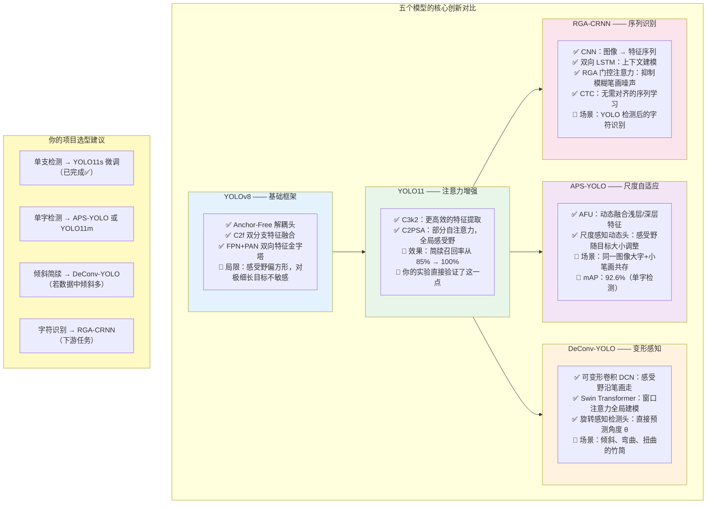

---

## 附：需要理解的原理（干完实验再读）

| 完成步骤 | 推荐读物 | 重点 |
|---------|---------|------|
| 步骤 2-4 | [YOLOv8 论文](https://arxiv.org/abs/2305.09972) | 对照 C2f 和解耦头的代码，看 Fig.2 |
| 步骤 5-7 | [YOLO11 技术报告](https://docs.ultralytics.com/models/yolo11/) | 找 C2PSA 的消融实验，验证你的结论 |
| 步骤 8-9 | APS-YOLO 论文（搜索 "APS-YOLO bamboo slip"）| 看 AFU 的可视化热图 |
| 步骤 10-11 | [Deformable Convolutional Networks](https://arxiv.org/abs/1703.06211) | 看 Fig.3，DCN 采样点可视化 |
| 步骤 12-13 | [CTC 原论文](https://www.cs.toronto.edu/~graves/icml_2006.pdf) | 看 Eq.4，理解路径概率 |

---

## 附：论文写作对应表

| 步骤完成 | 可写入论文章节 |
|---------|--------------|
| 步骤 2-4 | 第2.2节：YOLOv8 基础框架分析，附特征图尺寸变化表 |
| 步骤 5-7 | 第2.3节：YOLO11 架构改进，附注意力热图与参数对比 |
| 步骤 8-9 | 第2.4节：APS-YOLO 尺度自适应机制分析 |
| 步骤 10-11 | 第2.5节：DeConv-YOLO 可变形感知机制 |
| 步骤 12-13 | 第4.2节：RGA-CRNN 识别模块设计 |

---

*上次更新：2026年3月*
